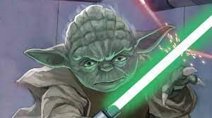

Una prueba

# Título
## Segundo título
### Tercer título

> Esto es una cita

**Este texto está en negrita**

_Este texto está en cursiva_

~~Este texto está equivocado~~

***Este texto es más importante***

Texto de subíndice

Texto de superíndice

[Vínculo(https://docs.github.com/es/get-started/writing-on-github/getting-started-with-writing-and-formatting-on-github/basic-writing-and-formatting-syntax)]

[Vínculo relativo(https://github.com/Ayesa14/primerosPasos2023/blob/main/Readme.md)]

## Listas

-Contornos
-Programación
-Base de datos

## Listas ordenadas

1. Rojo
2. Azul
3. Verde

## Listas anidadas

1. Pan
    - harina
    - agua
    - sal

## Listas de tareas

- [x] comprar comida
- [ ] bajar la basura
- [ ] sacar al perro

